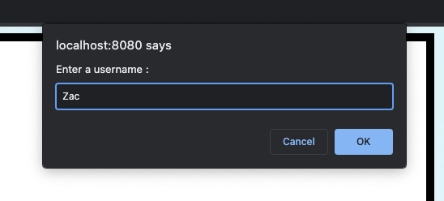
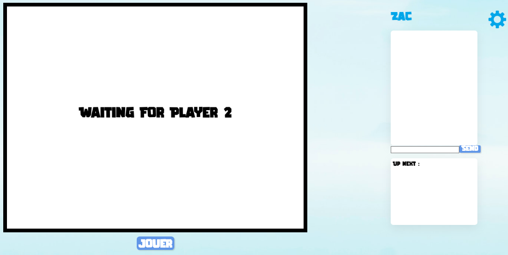
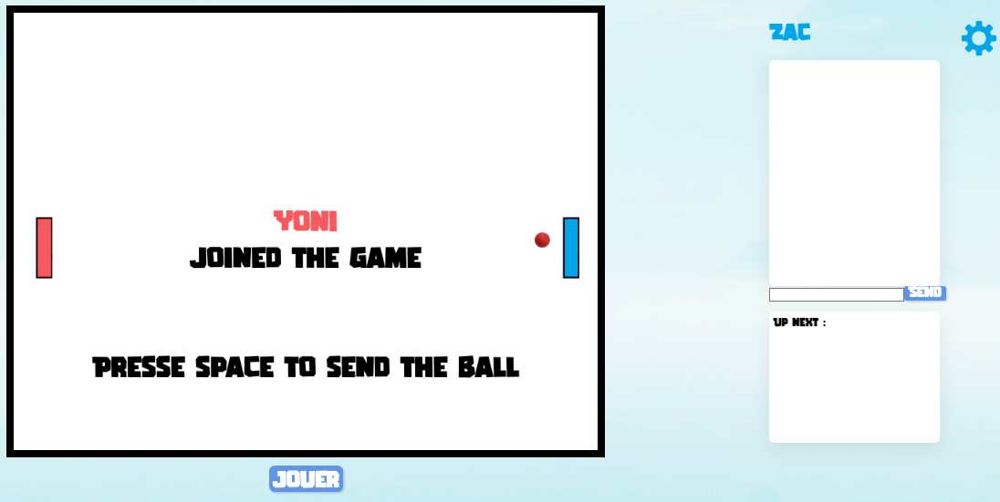
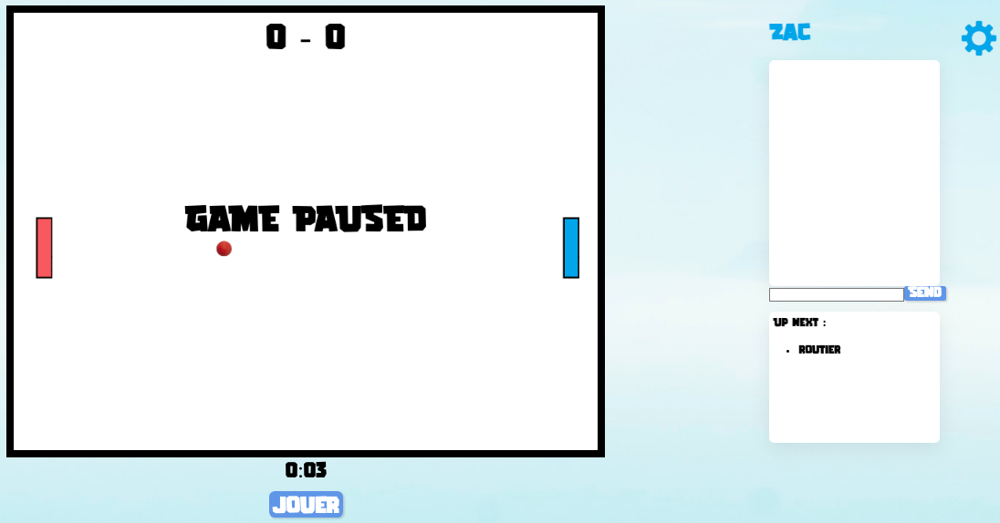
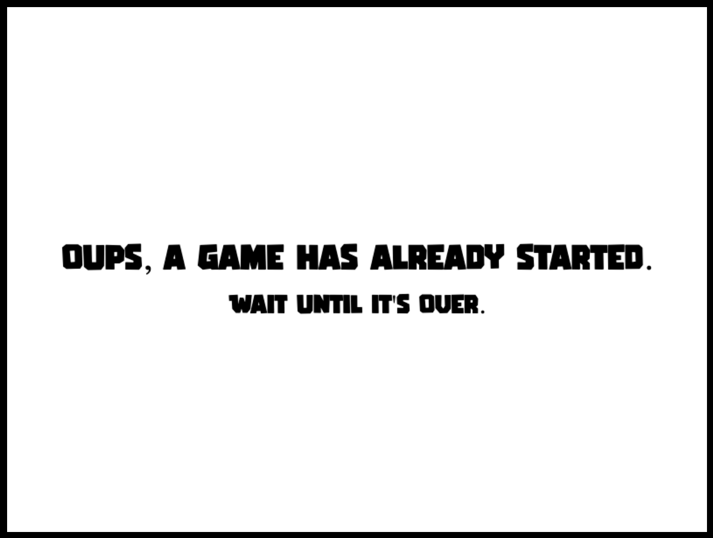
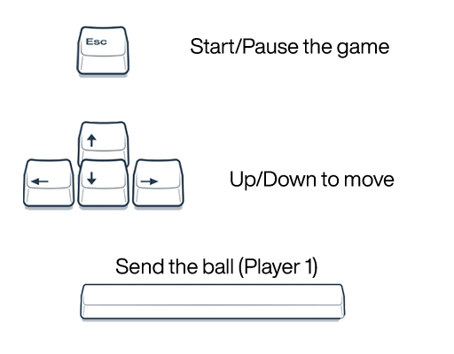

# Pong Game

## Le jeu

Le jeu est une version remastorisé de l'historique jeu Pong. Le jeu est disponible en une version réseau, les joueurs pourront s'affronter depuis deux ordinateurs différents.

## Installation 

-   Une fois cloné nous allons nous placer dans le repertoire du jeu avec la commande:
    ```console
        $ cd pong
    ```
-   Installation des modules nécessaires:

    ```console
        $ npm install
    ```
## Usage 

-   **Lancez le serveur (dossier `server`):**

    ```console
        $ npm start
    ```

-   **Puis ouvrir le lien :** [localhost://8080/public/index.html](http://localhost:8080/public/index.html)


- **Entrez un username, et dites à vos amis de rejoindre la partie :**

    


    


    


- **Lorsqu'un autre utilisateur essaye rejoindre un room plein, il sera envoyé dans un witing room,
 son tour commencera automatiquement qaund la partie actuelle sera terminée.** 

   


- **Ecran de cet utilisateur :** 



   <!--   -->

    

## Regles du jeu


Chaque joueur s'affronte en déplaçant la raquette virtuelle de haut en bas, via les fleches,
de façon à garder la balle dans le terrain de jeu. Le joueur peut changer la direction de la balle
en fonction de l'endroit où celle-ci tape sur la raquette.

Une partie dure 1:00 minutes, le gagnant reste tant dis que le perdant est redirigé vers une autre page et le premier utilisateur dans la liste d'attente sera introduit automatiquement dans le room pour jouer.

En cas d'égalité, les joueurs ont le droit à une partie supplémentaire.

Le perdant pourra rester seulement s'il n'y a pas d'autres utilisateurs qui attendent pour leur tour.

Les joueurs peuvent communiquer le chat positionné à droite (seulement les utilisateurs dans le room peuvent parler).

Une difficulté a été rajoutée (fireBall), si les joueurs ne marquent pas, la ball accélère.

    

